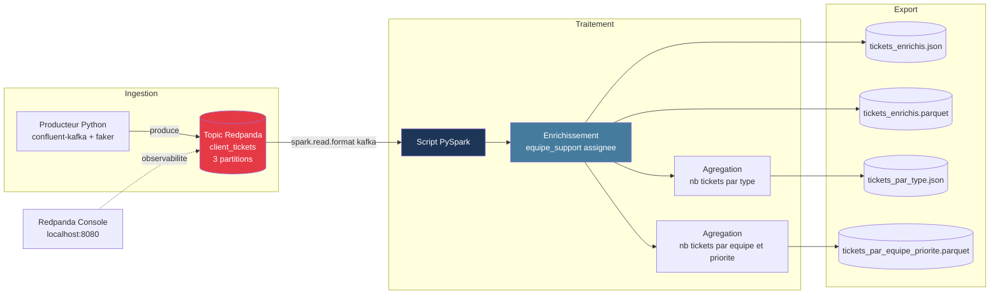

# poc_indutech
# POC — Gestion de tickets clients avec Redpanda & PySpark

Proof of Concept réalisé pour InduTech : pipeline de données temps réel pour ingérer,
traiter et analyser des tickets clients, en simulant l'infrastructure Redpanda utilisée
en production chez InduTech (AWS).

## Contexte

Les tickets sont générés en continu et contiennent :
- l'ID du ticket
- l'ID du client
- la date et l'heure de création
- la demande
- le type de demande
- la priorité

Ce POC démontre la faisabilité d'un pipeline complet : **génération → ingestion (Redpanda)
→ traitement distribué (PySpark) → export des résultats**, entièrement conteneurisé.

## Architecture du pipeline



## Stack technique

| Composant | Rôle | Technologie |
|---|---|---|
| Broker de messages | Ingestion temps réel des tickets | Redpanda (compatible API Kafka) |
| Producteur | Génère des tickets clients aléatoires | Python + `confluent-kafka` + `faker` |
| Traitement | Lecture, enrichissement, agrégations | PySpark 3.5.1 + connecteur Kafka |
| Orchestration | Démarrage ordonné de tous les services | Docker Compose |
| Observabilité | Visualisation des topics/messages | Redpanda Console |

## Structure du projet

```
indutech-tickets-poc/
├── docker-compose.yml       # orchestration de tous les services
├── producer/
│   ├── Dockerfile
│   ├── producer.py          # génère et envoie les tickets
│   └── requirements.txt
├── spark_processing/
│   ├── Dockerfile
│   ├── process_tickets.py   # lecture, enrichissement, agrégations, export
│   └── requirements.txt
├── data/
│   └── output/               # résultats générés (JSON + Parquet)
└── docs/                     # documentation, schémas
```

## Prérequis

- [Docker Desktop](https://www.docker.com/products/docker-desktop/) installé et lancé

Aucune autre installation n'est nécessaire (ni Python, ni Java, ni Spark) : tout tourne
dans des conteneurs isolés.

## Lancer le projet

Depuis la racine du projet :

```bash
docker-compose up --build
```

Cette commande :
1. démarre Redpanda et attend qu'il soit opérationnel (`healthcheck`) ;
2. crée automatiquement le topic `client_tickets` (3 partitions) ;
3. lance le producteur, qui envoie 200 tickets aléatoires dans le topic ;
4. lance le traitement PySpark : lecture des tickets, enrichissement (équipe de
   support assignée selon le type de demande), agrégations, puis export des
   résultats dans `data/output/`.

Les services `redpanda` et `redpanda-console` restent actifs. Pour tout arrêter :

```bash
docker-compose down -v
```

## Visualiser les données ingérées

Une fois `docker-compose up` lancé, ouvrez [http://localhost:8080](http://localhost:8080)
pour explorer le topic `client_tickets` via la Redpanda Console (messages, partitions,
offsets).

## Résultats produits

À la fin de l'exécution, `data/output/` contient :

| Fichier | Contenu |
|---|---|
| `tickets_enrichis_json/` | Tous les tickets, avec l'équipe de support assignée |
| `tickets_enrichis_parquet/` | Idem, au format Parquet (optimisé pour l'analytique) |
| `tickets_par_type_json/` | Nombre de tickets par type de demande |
| `tickets_par_equipe_priorite_parquet/` | Nombre de tickets par équipe et par priorité |

### Logique d'enrichissement (type de demande → équipe de support)

| Type de demande | Équipe assignée |
|---|---|
| Problème technique | Équipe Technique |
| Facturation | Équipe Facturation |
| Demande d'information | Équipe Relation Client |
| Réclamation | Équipe Qualité |
| Résiliation | Équipe Rétention |
| Support produit | Équipe Support Produit |

## Points de vigilance traités

- **Ordre de démarrage** : `depends_on` avec conditions (`service_healthy`,
  `service_completed_successfully`) garantit que Redpanda est prêt avant la création
  du topic, et que les tickets sont envoyés avant que Spark ne les lise.
- **Résilience** : le script PySpark implémente un mécanisme de retry
  (`lire_depuis_kafka_avec_retry`) en cas d'échec de connexion à Redpanda.
- **Performance Spark** : `spark.sql.shuffle.partitions` et la mémoire du driver sont
  configurés pour un usage POC (ajustables selon le volume de données réel en
  production).

## Démonstration vidéo

📺 [Lien vers la vidéo de démonstration](À COMPLÉTER)

La vidéo présente : le lancement du pipeline, la visualisation des tickets dans
Redpanda Console, et les résultats du traitement PySpark.

## Limites du POC et pistes d'évolution

- Traitement actuellement en **batch** (`spark.read`) plutôt qu'en flux continu
  (`spark.readStream`) — une évolution naturelle pour un usage temps réel.
- Un seul nœud Redpanda (pas de réplication) — à adapter pour un déploiement en
  production sur AWS (cluster multi-nœuds).
- Génération de tickets aléatoires à des fins de démonstration ; à remplacer par une
  source réelle (API, CDC depuis une base de données, etc.).
